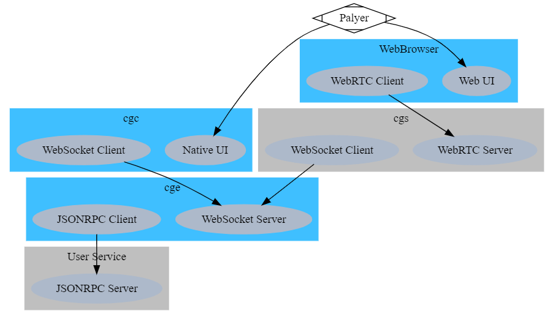
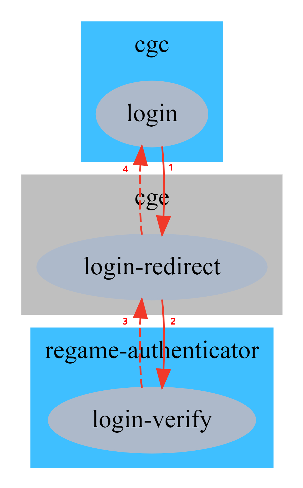
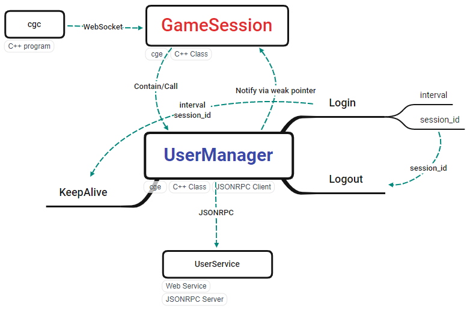
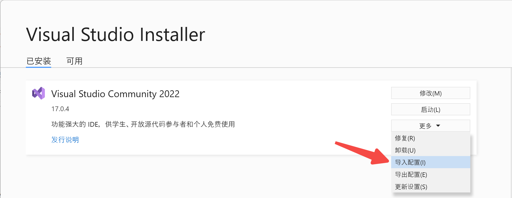

# Regame - Cloud Gaming Engine

[简体中文](README.zh-CN.md) | English

`Regame - Cloud Gaming Engine` is a set of technologies developed by Edge computing team of [Ksyun](https://www.ksyun.com/) to serve the cloud game scene.

Cloud gaming is a method of playing video games that is done using remote hardware. You don't have to download or install games locally, just begin playing the game immediately because it is being run on remote servers. 

Cloud gaming engine is a core technology to host ordinary games on remote server and start cloud gaming service.

`Regame` means `remote game`. It's also the transliteration of `鎏光` in Chinese. We start with Chinese name, and then English name.

`Regame` is still under development. It would be great if you could help.

[Download Regame v0.4 here](https://ks3-cn-beijing.ksyun.com/liuguang/regame_v0.4.zip) \(It will be updated from time to time!\)

Demo videos (Chinese):

- 01-Regame Cloud Gaming Demo - Street Fighter

  - [Youtube](https://youtu.be/9LYxeXfJ0og)

  - [bilibili](https://www.bilibili.com/video/bv1jt4y1r7GT), [ixigua](https://www.ixigua.com/6898563893564703239), [zhihu](https://www.zhihu.com/zvideo/1314567244832530432)

- 09-Regame WebRTC - Accelerate the cloud trip of enterprise business - English subtitle

  - [Youtube](https://youtu.be/r98-VwSDOjg)

  - [bilibili](https://www.bilibili.com/video/BV1g34y1U7RL), [ixigua](https://www.ixigua.com/7023285940831552031) , [zhihu](https://www.zhihu.com/zvideo/1436363494992445440)

## 1. Requirements

### Server

| Target | Minimum | Recommended |
| --- | --- | --- |
| System | Windows 7 and later | Windows 10, 11 |
| GPU | NVIDIA GPU | GTX 1080Ti, RTX 2070S tested |
| Software | GeForce Experience | latest GeForce Experience |
| Driver | GeForce Game Ready Driver | latest GeForce Game Ready Driver |

### Client

| Target | Minimum | Recommended |
| --- | --- | --- |
| System | Windows 7 and later | Windows 10, 11 |
| CPU | ANY | amd64 |

## 2. Basic

- `cgh` use Hook technology to capture image, support most of DirectX games, such as Cyberpunk 2077, Street Fighter.

- `cge` use FFmpeg to encode audio and images `cgh` captured into streaming.

- `cgc` use FFmpeg to decode audio and video frames, and use SDL2 to play audio and show images.

[](doc/regame-components.gv)

[](doc/cg.gv)

## 3. QuickStart

[FAQ](doc/faq.md)

### cge

The `Cloud Gaming Engine`.

You can launch `cge` directly, which will apply default options.

Run `cge --help` to see all options:

```
KSYUN Edge Cloud Gaming Engine v0.4 Beta

Usage:
  -h [ --help ]                         Produce help message
  --audio-bitrate arg (=128000)         Set audio bitrate
  --audio-codec arg (=libopus)          Set audio codec. Select one of
                                        {libopus, aac, opus}
  --bind-address arg (=::)              Set bind address for listening. eg:
                                        0.0.0.0
  --disable-keys arg                    Disable virtual keys. eg: 164,165
                                        disable ALT; 91,92 disable WIN
  --donot-present arg (=0)              Tell cgh don't present
  --desktop-mode arg (=0)               Set desktop mode
  -g [ --global-mode ] arg (=0)         In global mode, will prefix object
                                        names with Global\.
  --gamepad-replay arg (=none)          Set gamepad replay method. Select one
                                        of {none, cgvhid, vigem}
  --hardware-encoder arg                Set video hardware encoder. Select one
                                        of {amf, nvenc, qsv}
  --keyboard-replay arg (=none)         Set keyboard replay method. Select one
                                        of {none, cgvhid, sendinput, message}
  --log-level arg (=info)               Set logging severity level. Select one
                                        of {trace, debug, info, warning, error,
                                        fatal}
  --mouse-replay arg (=none)            Set mouse replay method. Select one of
                                        {none, cgvhid, sendinput, message}
  -p [ --port ] arg (=8080)             Set the service port
  --user-service arg (=http://127.0.0.1:8545/)
                                        Set address for user service.
  --video-bitrate arg (=1000000)        Set video bitrate
  --video-codec arg (=h264)             Set video codec. Select one of {h264,
                                        h265, hevc}, h265 == hevc
  --video-gop arg (=180)                Set video gop. [1, 500]
  --video-preset arg                    Set preset for video encoder. For AMF,
                                        select one of {speed, balanced,
                                        quality}; For NVENC, select one of {p1,
                                        p2, p3, p4, p5, p6, p7, slow, medium,
                                        fast}; For QSV, select one of
                                        {veryfast, faster, fast, medium, slow,
                                        slower, veryslow}; otherwise, select
                                        one of {ultrafast, superfast, veryfast,
                                        faster, fast, medium, slow, slower,
                                        veryslow, placebo}
  --video-quality arg (=23)             Set video quality. [0, 51], lower is
                                        better, 0 is lossless.
```

You can press `Ctrl+C` to stop it gracefully.

### regame-user-service

`cge` uses [regame-user-service](https://github.com/ksyun-kenc/regame-user-service) to to maintain user state, such as verify login.

[](doc/regame-authenticator.gv)



### regame-web-client

A simple [web client of Regame](https://github.com/ksyun-kenc/regame-web-client). You can help us to improve it!

### cgh

Some hook dlls for capturing pictures from D3D game.

### cgi

A tool for injecting hook dll into game process.

[](doc/cgi.gv)

```
Allowed options:
  -h [ --help ]              Produce help message
  -d [ --dynamic ] arg       Use dynamic injecting
  -e [ --exec ] arg          Path of the executable
  -a [ --arg ] arg           Arguments of the executable
  -c [ --cd ] arg            Current directory for the executable
  -i [ --imagename ] arg     Image name of the process being injected.
  -w [ --wait ] arg (=1,000) Wait before injecting. unit: ms
  --lx86 arg                 Path of x86 library to inject into process
  --lx64 arg                 Path of x64 library to inject into process
```

### cgvhid

Cloud gaming Virtual HID driver. For replaying controller event on server.


### cgvd (Enterprise version only)

Cloud gaming Virtual Display. It's an Indirect Display Driver for capturing screen on server. After installing `cgvd`, run `cge -g` to interact with cgvd.

### video_source

A tool for testing. Just run it, and it will generate simple pictures and write them as video frames to shared memory, then notify `cge` to fetch. You can use `cgc` to see these pictures.

It also can be used to test latency.

Video Reference (Chinese):

- 05-Regame Cloud Gaming Engine: Latency Test

  - [Youtube](https://youtu.be/u3OEDOlhGxo)

  - [bilibili](https://www.bilibili.com/video/BV1KU4y147ks/), [ixigua](https://www.ixigua.com/6918363287298146823)

### cgc

A simple client to work with `cge`.

```
Ksyun Edge Cloud Gaming Client v0.3 Beta

Usage:
  -h [ --help ]                         Produce help message
  --audio-frame-delay arg (=2)          Set audio frame max delay, [0, 8]
  -f [ --fullscreen-state ] arg (=none) Set fullscreen state, can be one of
                                        {none, real, fake}
  -l [ --list-hardware-decoder ]        List hardware decoder
  -d [ --hardware-decoder ] arg         Set hardware decoder
  -r [ --remote-host ] arg (=127.0.0.1) Set remote host
  -p [ --remote-port ] arg (=8080)      Set remote port
  --top-most arg                        Keep the main window always on top
  -u [ --username ] arg                 Set username
  --verification-code arg               Set verification code
  --volume arg (=100)                   Set volume, [0, 100]
```

### cgs (Enterprise version only)

A WebRTC server works together with `cge`, to serve web clients.

## 4. Setting Up Your Build Environment

### 4.1 Visual Studio

#### 4.1.1  VS2019

Only required by WDK.

#### 4.1.2 VS2022

[Reference .vsconfig](doc/.vsconfig)



### 4.2 Boost

Install [Boost](https://www.boost.org/) and set `BOOST_ROOT` environment variable to install directory. [Details](https://blog.umu618.com/2020/09/11/umutech-boost-1-installation/)

Boost compile command:

```
# For MTRelease configuration
.\b2 --address-model=64 runtime-link=static
```

Video Reference (Chinese):

- 06-Regame Cloud Gaming Engine FAQ: Compile Boost

  - [Youtube](https://youtu.be/daQjeYPZD6o)

  - [bilibili](https://www.bilibili.com/video/BV1P5411J7L8/), [ixigua](https://www.ixigua.com/6922104314932986376)

### 4.3 FFmpeg

Set `FFMPEG_ROOT` environment variable to the path of your [FFmpeg](https://www.ffmpeg.org/download.html) directory. [LGPL shared is recommended.](https://github.com/BtbN/FFmpeg-Builds/releases)

The folder tree should be like:

```
├─bin
├─include
│  ├─libavcodec
│  ├─libavdevice
│  ├─libavfilter
│  ├─libavformat
│  ├─libavutil
│  ├─libpostproc
│  ├─libswresample
│  └─libswscale
└─lib
    ├─x64
    └─x86
```

Video Reference (Chinese):

- 04-Regame Cloud Gaming Engine FAQ: FFmpeg configuration

  - [Youtube](https://youtu.be/fdAg5vHR_pE)

  - [bilibili](https://www.bilibili.com/video/BV1Dh41127xo/), [ixigua](https://www.ixigua.com/6917303228136849933)

### 4.4 SDL

Set `SDL2_ROOT` environment variable to the path of your [SDL2](https://www.libsdl.org/) directory.

The same as [SDL_ttf 2.0](https://www.libsdl.org/projects/SDL_ttf/).

The folder tree should be like:

```
├─bin
├─include
│  └─SDL2
└─lib
    ├─x64
    └─x86
```

### 4.5 WDK and VS2019

Required by cgvhid, cgvidd.

### 4.6 Extra

DbgView: Included in [Sysinternals Suite](https://www.microsoft.com/store/productId/9P7KNL5RWT25)

## 5. Building and Testing

```
git clone https://github.com/ksyun-kenc/liuguang
cd liuguang
git submodule update --init
```

Open each solution file with VS, prefer to select MTRelease configuration, then build.

Test steps:

- Run `cge` on server.

- Run `video_source` on server.

- Run `cgc -r <server_address>` on anther PC as long as it can access the server over the network.

Test with games:

Assume you want to test USF4.

- Install `cgvhid` on server. [Details](src/cgvhid/cgvhid/)

- If you prefer gamepad to keyboard, install `ViGEmBus` on server. [Download](https://github.com/ViGEm/ViGEmBus/releases)

- Run `cge --keyboard-replay=cgvhid --gamepad-replay=vigem` on server.

- Run `cgi -d true -e SSFIV.exe -i SSFIV.exe --lx86 .\captureyuv.dll` on server.

- Run `cgc -r <server_address>` on anther PC as long as it can access the server over the network.

**Note** that only support D3D9, D3D11, D3D12 games now.

Video Reference (Chinese):

- 02-Regame Cloud Gaming Engine Test Steps

  - [Youtube](https://youtu.be/8pEhg379ASo)

  - [bilibili](https://www.bilibili.com/video/BV17T4y1N7bk/), [ixigua](https://www.ixigua.com/6909415761098310158), [zhihu](https://www.zhihu.com/zvideo/1325164569828806656)

## 6. Contact Us

WeChat: UMUTech

- Please have "regame" or "liuguang" included in friend request.

- Will be more efficient if you could tell me the name of your company.

- Freelancers and independent develops are also welcome.

## 7. Known Users

<https://github.com/ksyun-kenc/liuguang/wiki/known-users>
